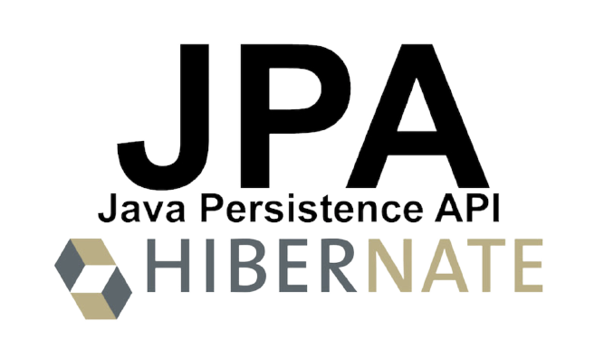
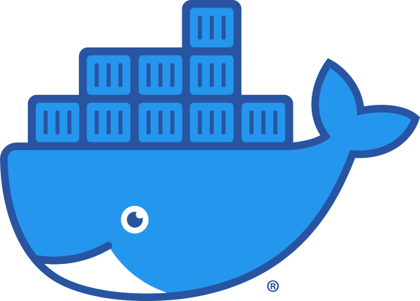
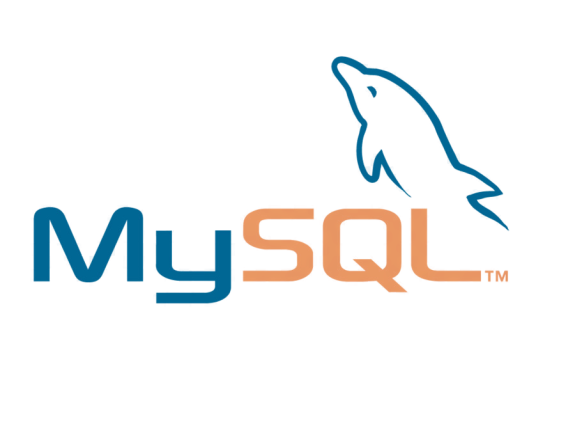

# 자율 프로젝트

## 목차

- 자율 프로젝트
  - [목차](#목차)
  - [카테고리](#카테고리)
  - [프로젝트 소개](#프로젝트-소개)
  - [팀 소개](#팀-소개)
  - [기술 스택](#기술-스택)
  - [프로젝트 진행](#프로젝트-진행)
    - [자율-1주차](#자율-1주차)
    - [자율-2주차](#자율-2주차)
    - [자율-3주차](#자율-3주차)
    - [자율-4주차](#자율-4주차)
    - [자율-5주차](#자율-5주차)
    - [자율-6주차](#자율-6주차)

<!-- 필수 항목 -->

## 카테고리

| Application                       | Language                      | Framework                            |
| --------------------------------- | ----------------------------- | ------------------------------------ |
| :white_check_mark: Desktop Web    | :white_check_mark: JavaScript | :black_square_button: Vue.js         |
| :white_check_mark: Mobile Web     | :white_check_mark: TypeScript | :white_check_mark: React             |
| :white_check_mark: Responsive Web | :black_square_button: C/C++   | :black_square_button: Angular        |
| :black_square_button: Android App | :black_square_button: C#      | :black_square_button: Node.js        |
| :black_square_button: iOS App     | :black_square_button: Python  | :black_square_button: Flask/Django   |
| :black_square_button: Desktop App | :white_check_mark: Java       | :white_check_mark: Spring/Springboot |
|                                   | :black_square_button: Kotlin  | :white_check_mark: Next.js           |

[프론트엔드 학습내용](/문서/FRONTEND.md)  
[백엔드 학습내용](/문서/BACKEND.md)

<!-- 필수 항목 -->

## 프로젝트 소개

- 프로젝트명 :  Make our special:어드벤트 스페셜데이

  > 안녕하세요 어스입니다
  >
  > 특별한 날을 기다리며 매일 매일 설레는 마음으로 언박싱하는 기분 느껴보고 싶지 않으신가요?
  >
  > 소중한 날을 기념하여 자신 또는 가족, 친구, 지인, 연인분께 직접 꾸민 어드벤트 스페셜데이를 선물해보세요

  - 노션 : [어스](https://butter-innocent-113.notion.site/Make-our-special-233191af396f4354a629fe7b39bae698)

- 서비스 특징

  - 어드벤트 캘린더의 온라인 서비스 

     특별한 날을 디데이로 설정하고 상자 안에 이미지 및 편지를 담아 매일 하나씩 열어볼 수 있도록 하  는 온라인 선물하기 서비스

- 기간 : 2022.04.11 ~ 2022.05.27

- 주요 기능

  | 서비스                      | 주요 기능                                                    |
  | --------------------------- | ------------------------------------------------------------ |
  | 어드벤트 스페셜 데이 만들기 | 로그인한 사용자는 기간, 겉표지, 내용물을 입력한 후 자신만의 어드벤트 스페셜 데이를 만들 수 있다. |
  | 어드벤트 스페셜 데이 공유   | 자신이 만든 어드벤트 스페셜 데이를 카카오톡 메시지로 전달할 수 있다. |
  | 어드벤트 스페셜 데이 확인   | 카카오톡에서 전달받은 url로 들어오면 비밀번호를 입력하고 자신이 받은 어드벤트 스페셜 데이를 확인할 수 있다. |

- 상세기능

  - 소셜로그인
    - 카카오 소셜로그인을 제공합니다.
  - 메인페이지
    - 로그인 유저
      - 로그인을 하게 되면 어드벤트 스페셜 데이를 만들거나 자신이 만든 어드벤트 스페셜 데이를 확인할 수 있습니다.
    - 비로그인 유저
      - 비회원 사용자는 카카오톡 로그인을 통해 서비스를 이용할 수 있습니다.
  - 작성페이지
    - 기간 선택 페이지
      - 작성하기를 누르면 먼저 1, 3, 7일 중 원하는 기간을 선택할 수 있습니다.
    - 작성/수정 페이지
      - 열기버튼을 눌러서 각각의 날에 해당하는 내용을 작성하는 페이지로 이동할 수 있습니다.
      - 배경과 스티커, 이미지 업로드를 통해 내용을 작성할 수 있습니다.
      - 포장지 선택을 눌러서 이미지를 업로드해 자신이 원하는 포장지를 선택할 수 있습니다.
      - “저장하기” 버튼을 눌러 저장하고  “전달하기” 버튼을 통해 비밀번호와 힌트를 설정하고 어드벤트 스페셜 데이를 카카오톡 메시지로 전달할 수 있습니다.
      - 이미 작성된 페이지를 다시 들어갈 경우 수정할 수 있습니다.

  - 작성 보관함 페이지
    - 자신이 보냈던 어드벤트 스페셜 데이를 확인할 수 있습니다.
    - 전달하기 전 어드벤트 스페셜 데이일 경우 수정/삭제할 수 있습니다.

  - 받은 보관함 페이지
    - 어드벤트 스페셜 데이 송신자가 등록한 비밀번호를 hint을 통해 유추하여 받은 보관함 페이지로 이동할 수 있습니다.
    - d-day에 맞춰 하루에 하나씩 잠금이 풀린 어드벤트 스페셜 데이 메시지를 열어볼 수 있습니다.
    - 열기버튼을 눌러 어드벤트 스페셜 데이 상세페이지를 확인할 수 있습니다. 
  - 사용설명서
    - [Make Our Special:어드벤트 스페셜 데이 사용설명서](https://slime-capricorn-03e.notion.site/Make-our-special-7f0f4caec7f3447aaee2aaac52e88811)

- 주요 기술

  - Single Page Application
  - CSS
  - REST API

- 배포 환경

  - URL : // 웹 서비스, 랜딩 페이지, 프로젝트 소개 등의 배포 URL 기입

<!-- 자유 양식 -->

## 팀 소개

- 손민기 : `팀장`, 프론트엔드 개발
- 문찬송 : 프론트엔드 개발
- 하지애 : 프론트엔드 개발
- 김경민 : 백엔드 개발
- 박소진 : 백엔드 개발
- 오윤진 : 백엔드 개발

<!-- 자유 양식 -->

## 기술 스택

### **Front-end**

|  |  |  |  |  |  |  |
| :----------------------------------------------------------: | :----------------------------------------------------------: | :----------------------------------------------------------: | :----------------------------------------------------------: | :-------------------------------------------------------: | :----------------------------------------------------------: | :----------------------------------------------------------: |
|                            HTML5                             |                             CSS3                             |                       JavaScript(ES6)                        |                           React.js                           |                          NEXT.js                          |                          TypeScript                          |                      Semantic UI React                       |

### **Back-end**

|  |  |  |  |  |
| :----------------------------------------------------------: | :---------------------------------------------------: | :------------------------------------------------------: | :-------------------------------------------------------: | :--------------------------------------------------------: |
|                          Springboot                          |                          JPA                          |                          Gradle                          |                          Swagger                          |                          QueryDSL                          |

### **CI/CD**

|  |
| :-------------------------------------------------------: |
|                          Jenkins                          |

### **Server**

|  |  |  |  |
| :------------------------------------------------------: | :---------------------------------------------------: | :-----------------------------------------------------: | :----------------------------------------------------------: |
|                          Docker                          |                          aws                          |                         aws s3                          |                            NGINX                             |

### **DB**

|  |
| :-----------------------------------------------------: |
|                          MySQL                          |

### **Version Control**

|  |  |
|:-----------------------------------------------------------------------------------------------------------------:|:--------------------------------------------------------------------------------------------------------------:|
| Git                                                                                                               | GitLab                                                                                                         |

### **Issue Tracking System**

|  |
|:----------------------------------------------------------------------------------------------------------------------------------------------------------------------------------------:|
| Jira                                                                                                                                                                                     |

## 프로젝트 진행

### 자율-1주차

- 기간 : 2022.04.11 ~ 2022.04.15 (1주)

- 목표 :  프로젝트 기획 및 설계

- 진행상황
  
  - [서비스를-개발하기-전-기획-고민](/문서/서비스를-개발하기-전-기획-고민/README.md)
  
  - [MVP](/문서/MVP/README.md)
  
  - [와이어프레임-작성](/문서/와이어프레임-작성/README.md)
  
  - [화면설계](/문서/화면설계/README.md)
  
  - [기술스택](/문서/기술스택/README.md)
  
  - [ERD-설계](/문서/ERD-설계/README.md)
  
  - [팀규칙](/문서/팀규칙/README.md)
  
    
  

### 자율-2주차

- 기간 : 2022.04.18 ~ 2022.04.22 
- 진행상황
  - FE: 와이어프레임 기반 페이지 별 틀 제작
  - BE: 와이어프레임 기반 페이지 별 Entity 구성 및 기능 개발

### 자율-3주차

- 기간 : 2022.04.25 ~ 2022.04.29 

- 진행상황

  - FE: API와 연결

  - BE: 배포 준비

  

### 자율-4주차

- 기간 : 2022.05.02 ~ 2022.05.06 
- 진행상황
  - FE: 추가 기능 구현

  - BE: 추가 기능 구현

### 자율-5주차

- 기간 : 2022.05.09 ~ 2022.05.13 
- 진행상황
  - FE: 구현 기능 점검 및 보수
  - BE: API 수정 및 성능 개선

### 자율-6주차

- 기간 : 2022.05.16 ~ 2022.05.20 
- 진행상황
  - FE: 디자인 / 기능 마무리
  - BE: 기능 구현 마무리

